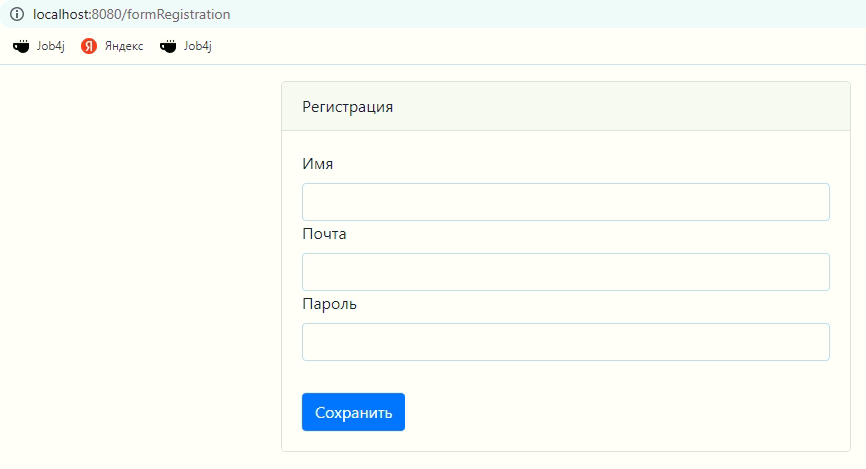

# job4j_cars
Репозиторий предназначен для проектирования web-приложения для продажи автомобилей.
### Стек технологий:
Spring boot, Thymeleaf, Bootstrap, Hibernate, PostgreSql
### Описание:
В приложении есть фильтр авторизации, при открытии любой страницы происходит переадресация на страницу авторизации.

Если у пользователя еще нет аккаунта, на странице авторизации есть ссылка на форму регистрации

После того, как пользователь авторизовался, он попадает на главную страницу

На главной странице есть возможность разместить объявление. Сначала открывается страница с выбором категориии

Затем страница с выбором кузова

Далее страница с выбором бренда

Страница с выбором модели

Страница с выбором типа двигателя

На завершающей странице по добавлению объявления о продаже прикрепляется фото, пишется название объявления и краткое описание

При нажатии кнопки "разместить" будет осуществлен переход на главную страницу, куда добавиться новое объявление.

При нажатии на фото объявления на главной странице осуществляется переход на страницу с подробным описанием

Для пользователя, разместившего данное объявление на странице с подробным описанием добавнены кнопки: "продано" и "удалить"

"продано" - при нажатии статус объявления меняется объявление больше не будет выводиться на главной странице, 
но его можно найти нажав ссылку "архив"

Нажав кнопку "удалить" - объявление удаляется из базы данных.

Для поиска подходящих объявлений исхдя из категории, кузова, брендад и марки автомобиля можно воспользоваться фильтром, 
который доступен при нажатии на кнопку "применить фильтр"
Так же можно осуществить фильтрацию для объявлений о продаже новых автомобилей и автомобилей с пробегом.